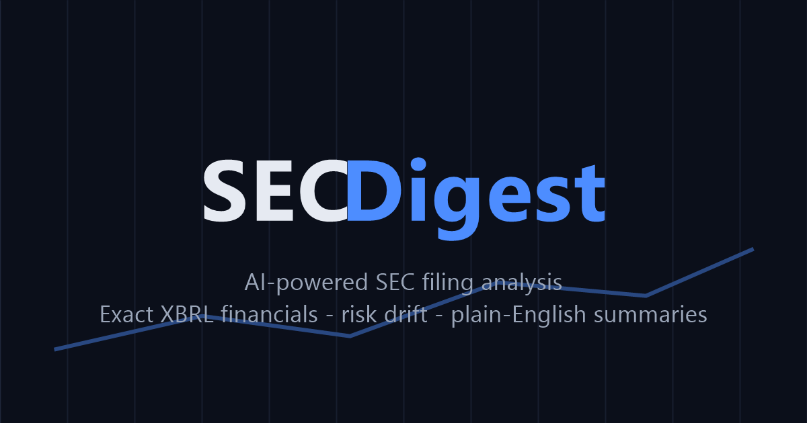
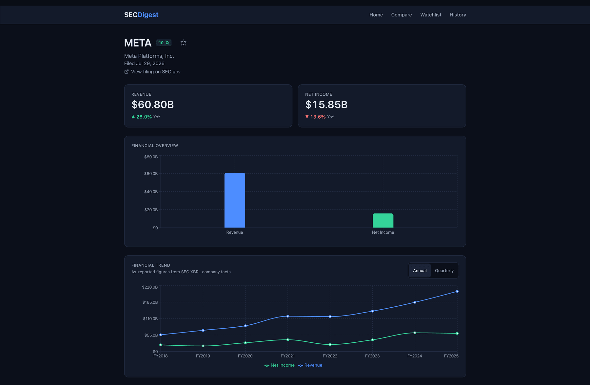
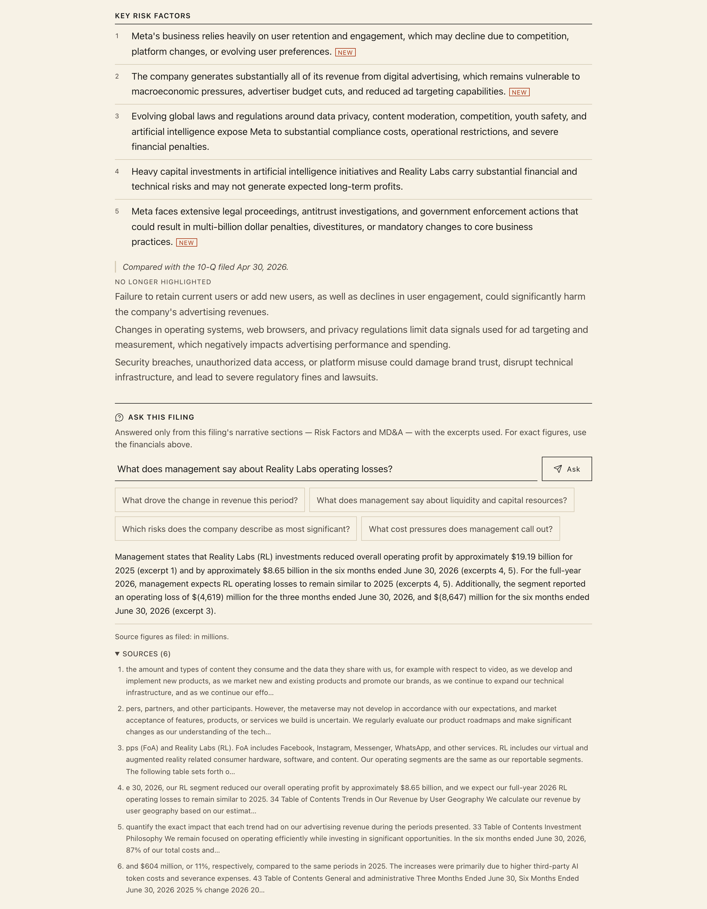

<div align="center">



# SECDigest

**Turn a 300-page SEC filing into a financial dashboard in under a minute.**

[](https://github.com/eriklarson12/SECDigest/actions/workflows/ci.yml)
[](https://secdigest.tech)
[](#development--testing)
[](https://www.python.org/)
[](https://nextjs.org/)
[](LICENSE)

[**Live app →**](https://secdigest.tech) · [API health](https://secdigest-api-4cea35f62561.herokuapp.com/api/health) · [API docs](https://secdigest-api-4cea35f62561.herokuapp.com/docs)

</div>

---

Search a ticker, pick a 10-K or 10-Q, and SECDigest pulls the filing straight from SEC EDGAR, extracts the numbers and narrative with Google Gemini, and renders it as a dark financial dashboard: revenue and net income with YoY deltas, key risk factors, management guidance, a plain-English summary, and multi-year trend charts. You can also ask the filing questions in plain English and get answers cited back to the passages they came from.

Every analysis is cached permanently, so the app accumulates a searchable historical record. The whole stack runs on free tiers.



## Table of Contents

- [Features](#features)
- [Tech Stack](#tech-stack)
- [Architecture](#architecture)
- [Getting Started](#getting-started)
- [Configuration](#configuration)
- [Development & Testing](#development--testing)
- [API Reference](#api-reference)
- [Extraction accuracy](#extraction-accuracy)
- [Engineering Highlights](#engineering-highlights)
- [Deployment](#deployment)
- [Limitations](#limitations)
- [License](#license)

## Features

- **Ticker search:** typeahead over the full SEC company list (10,000+ tickers), fully keyboard-navigable
- **Structured LLM extraction:** Gemini with a Pydantic-enforced JSON schema pulls revenue, net income, YoY changes, top risk factors, guidance, and a summary out of the raw filing
- **Exact financials from XBRL:** annual *and* quarterly revenue/net income come from SEC's XBRL API rather than the LLM, so the charts carry no extraction error; the per-year table includes diluted EPS and operating cash flow
- **"Ask this filing":** retrieval-augmented Q&A over the filing's own text (pgvector), answered from the nearest excerpts with those excerpts shown as sources
- **Risk-factor drift:** each dashboard flags risks that are new versus the company's previous filing, and risks that were dropped
- **Company pages and comparison:** per-company trend history at `/company/{ticker}`, two companies side by side at `/compare?a=AAPL&b=MSFT`
- **Watchlist:** star companies (browser-local, no account) and see when EDGAR has a filing newer than your latest analysis
- **History and CSV export:** every analysis stored, paginated, and downloadable
- **Permanent caching:** one analysis per filing, so repeat views are instant and cost nothing

<details>
<summary><b>Screenshot: risk drift and cited Q&A</b></summary>



</details>

## Tech Stack

| Layer | Technology |
|---|---|
| Frontend | Next.js 16 (App Router), React 19, TypeScript, Tailwind CSS v4, Recharts |
| Backend | Python 3.12, FastAPI, Pydantic v2, `httpx` |
| AI | Google Gemini (`google-genai` SDK) for extraction and Q&A; `gemini-embedding-001` for retrieval |
| Database | Supabase Postgres with pgvector |
| Data source | SEC EDGAR REST and XBRL APIs |
| Testing | pytest, pyright, Vitest, Playwright |
| Infrastructure | Vercel (frontend), Heroku container dyno (backend), GitHub Actions CI |

## Architecture

```
┌──────────────┐      ┌───────────────┐      ┌─────────────────────┐
│   Next.js    │ ───► │    FastAPI    │ ───► │  SEC EDGAR          │
│   (Vercel)   │      │   (Heroku)    │ ───► │  Google Gemini      │
└──────────────┘      └───────────────┘ ───► │  Supabase + pgvector│
                                             └─────────────────────┘
```

A request for a filing is cache-first: the backend checks Supabase by accession number, and only on a miss does it fetch from EDGAR, truncate the text to a token budget weighted toward Risk Factors and MD&A, call Gemini with a response schema, and persist the result. Filing text is chunked and embedded in the background so Q&A becomes available while the dashboard is already usable.

## Getting Started

### Prerequisites

- Python 3.12+
- Node.js 22+
- A [Gemini API key](https://aistudio.google.com/apikey) (free, no card required)
- A [Supabase](https://supabase.com) project (free tier)

### Installation

```bash
git clone https://github.com/eriklarson12/SECDigest.git
cd SECDigest
```

**Database.** Create a Supabase project, open the SQL Editor, and run [`backend/schema.sql`](backend/schema.sql).

**Backend**

```bash
cd backend
python -m venv .venv && source .venv/bin/activate   # .venv\Scripts\activate on Windows
pip install -r requirements.txt
cp .env.example .env                                 # fill in your keys
uvicorn app.main:app --reload
```

**Frontend** (in a second terminal)

```bash
cd frontend
npm install
cp .env.local.example .env.local
npm run dev
```

### Usage

Open <http://localhost:3000>, search a ticker (`AAPL`), pick a filing, and hit **Analyze**. The first analysis of a filing takes 10 to 60 seconds; every view after that is served from cache.

Interactive API docs are at <http://localhost:8000/docs>.

## Configuration

### Backend (`backend/.env`)

| Variable | Required | Description |
|---|:--:|---|
| `GEMINI_API_KEY` | ✅ | From [AI Studio](https://aistudio.google.com/apikey) |
| `SUPABASE_URL` | ✅ | Project Settings → API → Project URL |
| `SUPABASE_KEY` | ✅ | Project Settings → API Keys → **secret key** (`sb_secret_…`). Server-only; never expose to the frontend |
| `SEC_USER_AGENT` | ✅ | Required by SEC fair-access policy, e.g. `SECDigest you@email.com` |
| `FRONTEND_URL` | | CORS origin (default `http://localhost:3000`) |
| `GEMINI_MODEL` | | Analysis model (default `gemini-3.6-flash`) |
| `GEMINI_FALLBACK_MODEL` | | Retried once when the primary model's quota is exhausted (default `gemini-3.5-flash-lite`) |
| `GEMINI_QA_MODEL` | | Model for "Ask this filing" (default `gemini-3.5-flash-lite`). Gemini meters requests per model, so Q&A draws on its own quota pool |
| `GEMINI_EMBED_MODEL` | | Embedding model (default `gemini-embedding-001`, 768 dims) |
| `MAX_FILING_CHARS` | | Filing text cap sent to the LLM (default `600000`, roughly 150K tokens) |
| `DAILY_ANALYSIS_CAP` | | Global analyses per day (default `200`) |
| `MAX_REQUEST_BYTES` | | Request body cap (default `10000`) |

### Frontend (`frontend/.env.local`)

| Variable | Description |
|---|---|
| `NEXT_PUBLIC_API_URL` | Backend base URL, e.g. `http://localhost:8000/api` |

## Development & Testing

```bash
# Backend: 236 tests, type check, dependency audit
cd backend
pip install -r requirements.txt -r requirements-dev.txt
pytest
npx pyright
pip-audit -r requirements.txt

# Frontend: 73 unit tests, 34 E2E tests
cd frontend
npm test          # Vitest
npm run test:e2e  # Playwright (API mocked)
npm run lint
npm run build
```

GitHub Actions runs all of the above plus `npm audit` on every push and pull request; Dependabot proposes weekly dependency updates. Secret scanning runs locally as a gitleaks pre-commit hook (`pre-commit install`).

Filings analyzed before Q&A shipped, or whose background indexing was cut short by a restart, can be indexed in place without re-running the LLM:

```bash
cd backend
python -m scripts.backfill_chunks --dry-run   # preview
python -m scripts.backfill_chunks --limit 5
```

The extraction eval (see [Extraction accuracy](#extraction-accuracy)) is separate from the test suite, because it spends real LLM quota:

```bash
cd backend
python -m evals.eval_extraction run            # ~10 LLM calls, then scores and writes the report
python -m evals.eval_extraction run --resume   # reuse what already succeeded; only re-spend the rest
python -m evals.eval_extraction score          # re-score a saved run against XBRL (free)
```

## API Reference

| Method | Path | Description |
|---|---|---|
| `GET` | `/api/health` | Liveness check |
| `GET` | `/api/companies/search?q=` | Ticker/name typeahead |
| `GET` | `/api/filings/{cik}` | Recent 10-K/10-Q filings |
| `GET` | `/api/financials/{cik}` | Exact annual and quarterly figures from SEC XBRL |
| `POST` | `/api/analysis` | Analyze a filing: cache-first, then EDGAR → Gemini → Supabase |
| `GET` | `/api/analysis` | List analyses, optional ticker filter and pagination |
| `GET` | `/api/analysis/{id}` | Single analysis |
| `POST` | `/api/analysis/{id}/ask` | Ask a question about the filing: vector search → cited answer |
| `GET` | `/api/analysis/{id}/index-status` | Q&A indexing progress for a filing |

All endpoints are per-IP rate limited; analysis endpoints additionally share a global daily cap.

## Extraction accuracy

The LLM reads revenue and net income out of a filing's prose. SEC publishes what the filer *tagged* for the same period in XBRL. That makes free, authoritative ground truth available for exactly the numbers the model extracts, with no labelling required, so extraction accuracy is measured rather than assumed.

`backend/evals/` scores the real pipeline (section-aware truncation and all) against XBRL across a golden set of ten diverse 10-Ks: mega-cap tech, a bank, a retailer, two companies posting net losses. A figure counts correct within ±1%. Misses are classified rather than just counted: `scale` (the filing said "in thousands" and the model didn't apply it), `sign`, or `period` (it read the comparative column). Classifying them is what turns a percentage into something actionable.

<!-- ACCURACY_TABLE -->

| Run | Model | Filings | Fields scored | Correct |
|---|---|---|---|---|
| 2026-08-14 | `gemini-3.6-flash` | 10 | 40 | 100.0% |

<!-- /ACCURACY_TABLE -->

Two design points worth noting. The eval is split into `run` (the only step that spends LLM quota, one request per filing) and `score` (free, and re-runnable against saved extractions), so re-scoring after a rule change costs nothing and the comparison logic is unit-tested in CI with no network. And ground truth is pinned on disk: a company restating its financials between two runs would otherwise silently move a months-old baseline, which is precisely the before/after comparison the harness exists to make.

## Engineering Highlights

A few problems that shaped the design:

- **Token budgets, spent where they matter.** A 10-K can exceed the model's practical input budget, so filing text is truncated section-aware. Risk Factors and MD&A take priority over exhibits and boilerplate, putting the budget on the parts an analyst actually reads.
- **Two very different rate limits, two very different responses.** The embedding API caps both tokens-per-minute and requests-per-day, where a "request" is one text rather than one HTTP call. The per-minute ceiling is *paceable*, so a rolling-window token pacer smooths work under it; the daily ceiling is not, so hitting it raises a distinct error that stops the run cleanly instead of retrying into a wall.
- **Indexing that doesn't block the user.** Embedding a filing takes minutes, so `POST /api/analysis` embeds nothing synchronously; it returns immediately and hands off to a background task. The UI shows a fourth state beyond loading, empty, and error: *partial*. Q&A stays enabled the whole time, because what's already indexed is already answerable.
- **Exact numbers where exactness is available.** LLMs misread financial tables. Chart and table figures come from SEC's XBRL API, not from the model; the LLM is reserved for the work only it can do, which is summarizing narrative and identifying risks.
- **Units resolved out of band.** A filing declares "(in millions, except per share data)" once, in a header that vector search almost never returns. The scale governing the matched passage is looked up separately and surfaced with the answer, so `$11,133` isn't silently read as eleven thousand dollars.

## Deployment

Live at **[secdigest.tech](https://secdigest.tech)** on a $0 infrastructure budget.

- **Backend → Heroku**, container stack: the root `heroku.yml` builds `backend/Dockerfile`. Pinned to **one dyno, one worker**, because the embedding rate limiter is process-local by design.
- **Frontend → Vercel**, with Root Directory set to `frontend/` and `NEXT_PUBLIC_API_URL` pointed at the backend.
- Set `FRONTEND_URL` on the backend to the frontend's origin to close the CORS loop.

## Limitations

- **Free-tier LLM quotas.** Gemini's free limits shift and are enforced per model. The analyze endpoint is rate limited and returns a friendly 503 when quota is exhausted. Note that free-tier prompts may be used for training. Filings are public, but this also covers questions typed into "Ask this filing".
- **Q&A coverage ramps up.** Indexing runs for several minutes after an analysis. Because text is prioritized toward Risk Factors and MD&A, Q&A answers narrative questions well but generally can't retrieve figures from statement tables; the XBRL charts cover those.
- **Background indexing doesn't survive a restart.** A deploy leaves a filing partially indexed, and the backfill script resumes from stored progress. Persisting a job queue would mean infrastructure this project deliberately doesn't have.
- **Single-period LLM extraction.** Each analysis stores one period plus YoY change; multi-year trends come from XBRL instead.
- **Supabase free tier pauses** after roughly 7 days of inactivity. A scheduled GitHub Actions job pings a database backed endpoint twice a week to keep the project awake.

## License

Released under the [MIT License](LICENSE).

---

Built by [Erik Larson](https://github.com/eriklarson12). Not investment advice. Always verify figures against the original filing, linked from every dashboard.
